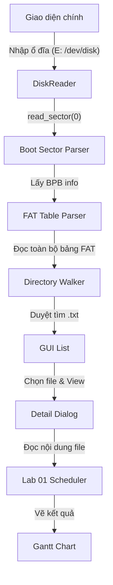

# Lab 02 – Giải Thích Toàn Bộ Luồng Hoạt Động (Kèm Code)

> Tài liệu này giải thích **từng dòng code quan trọng** cách ứng dụng Lab 02 hoạt động:
> từ lúc mở ổ đĩa vật lý cho đến lúc chạy thuật toán lập lịch.

---

## 1. Bức Tranh Tổng Quan

Lab 02 kết hợp việc **đọc đĩa ở mức thấp (raw byte)** và **giao diện người dùng (GUI)** để tái sử dụng engine của Lab 01.



---

## 2. Chi Tiết Từng Giai Đoạn (Kèm Snippets)

### 📌 Giai đoạn 1: DiskReader – Mở "Cổng" Kết Nối Ổ Đĩa

File `src/fat32/reader.py` chịu trách nhiệm mở file/thiết bị ở chế độ binary (`rb`).

**Code quan trọng:**

```python
# src/fat32/reader.py
def __init__(self, drive_letter: str):
    # Windows: \\.\E: | macOS: /dev/rdisk2s1
    if sys.platform == "win32":
        self._path = rf"\\.\{drive_letter}:"
    else:
        self._path = drive_letter # ví dụ /dev/rdisk4s1
    
    self._handle = open(self._path, "rb") # Mở dạng byte thô
```

> [!NOTE]
> `DiskReader` còn có hàm `_detect_partition()` để tự động bỏ qua MBR (nếu có) và tìm đúng vị trí bắt đầu của phân vùng FAT32 (Partition Offset).

---

### 📌 Giai đoạn 2: Boot Sector – Đọc "Bản Đồ"

File `src/fat32/boot_sector.py` dùng `struct` để cắt 512 byte đầu tiên thành các con số có ý nghĩa.

**Code quan trọng:**

```python
# src/fat32/boot_sector.py
_BPB_FIELDS = [
    ("BytsPerSec",  11, "<H"),   # Offset 11, 2 byte (H)
    ("SecPerClus",  13, "<B"),   # Offset 13, 1 byte (B)
    ("RsvdSecCnt",  14, "<H"),   # Offset 14, 2 byte
    ("NumFATs",     16, "<B"),   # Offset 16, 1 byte
    ("TotSec32",    32, "<I"),   # Offset 32, 4 byte (I)
    ("FATSz32",     36, "<I"),   # Offset 36, 4 byte
    ("RootClus",    44, "<I"),   # Offset 44, 4 byte
]

def parse_boot_sector(data: bytes):
    info = {}
    for name, offset, fmt in _BPB_FIELDS:
        # Cắt bytes tại offset và chuyển thành số theo định dạng fmt
        info[name] = struct.unpack_from(fmt, data, offset)[0]
    return info
```

---

### 📌 Giai đoạn 3: FAT Table – Theo Dấu Cluster

File `src/fat32/fat_table.py` giúp ta biết một file "nhảy" qua những vị trí nào trên đĩa.

**Logic cốt lõi:**

```python
# src/fat32/fat_table.py
def get_chain(self, start_cluster: int):
    chain = []
    cur = start_cluster
    while cur is not None:
        chain.append(cur)
        # Tra bảng FAT: FAT[cur] chứa vị trí của cluster tiếp theo
        cur = self.next_cluster(cur) 
    return chain
```

---

### 📌 Giai đoạn 4: Directory Walker – Duyệt Thư Mục

File `src/fat32/directory.py` thực hiện đệ quy để tìm tất cả file `.txt`. Nó phải xử lý cả **LFN (Long File Name)**.

**Xử lý LFN & Entry:**

```python
# src/fat32/directory.py
def _walk_directory(..., current_path, results):
    # Đọc bytes của thư mục từ chuỗi cluster
    raw = fat.read_chain_data(dir_cluster, ...)
    
    for i in range(len(raw) // 32):
        entry = raw[i*32 : (i+1)*32]
        attr = entry[11]
        
        if attr == 0x0F: # Đây là một mảnh của tên dài (LFN)
            order = entry[0] & 0x3F
            lfn_parts.append((order, _parse_lfn_chars(entry)))
            continue
            
        # Ghép các mảnh LFN lại để có tên đầy đủ (ví dụ "bài tập.txt")
        display_name = "".join(parts) if lfn_parts else _parse_short_name(entry)
        
        if attr & 0x10: # Nếu là thư mục -> đi sâu vào tiếp
            _walk_directory(..., current_path + display_name + "/", results)
        elif display_name.lower().endswith(".txt"): # Nếu là file .txt -> lưu lại
            results.append(FileEntry(display_name, path, size, first_cluster, ...))
```

---

### 📌 Giai đoạn 5: Detail Dialog – Chạy Lập Lịch

Khi bạn nhấn **"View Details"**, file `src/gui/detail_dialog.py` sẽ ghép nối mọi thứ lại.

**Luồng thực thi:**

1. **Đọc nội dung:** Dùng `fat.read_chain_data(first_cluster)` để lấy toàn bộ byte của file `.txt`.
2. **Parse:** Gọi `parse_input_bytes(raw_content)` (từ Lab 01) để chuyển text thành list `Process`.
3. **Run:** Gọi `run_scheduling(queues, processes)` (thuật toán Lab 01).
4. **Vẽ:** Dùng `buildReport()` để liệt kê kết quả dạng bảng và metrics.

```python
# src/gui/detail_dialog.py
def __init__(self, entry: FileEntry, raw_content: bytes):
    # 1. Hiển thị thông tin FAT32 (size, date, cluster...)
    
    # 2. Parse nội dung file (công việc của Lab 1)
    queues, processes = parse_input_bytes(raw_content)
    
    # 3. Chạy engine lập lịch (công việc của Lab 1)
    segments, result_procs = run_scheduling(queues, processes)
    
    # 4. Hiển thị kết quả lên giao diện
    self.report_view.setPlainText(buildReport(segments, result_procs))
```

---

## 3. Tổng Kết Các Hàm "Xương Sống"

| Công việc | Hàm thực hiện | File |
|---|---|---|
| **Đọc byte thô** | `read_sector(lba)` | `reader.py` |
| **Bóc tách BPB** | `parse_boot_sector(data)` | `boot_sector.py` |
| **Nối chuỗi cluster** | `get_chain(start_cluster)` | `fat_table.py` |
| **Tìm file .txt** | `_walk_directory(...)` | `directory.py` |
| **Ghép nối Lab 1** | `run_scheduling(...)` | `detail_dialog.py` |

---

## 4. Lưu Ý Về Kỹ Thuật

1. **Endianness**: FAT32 dùng **Little Endian** (số thấp đứng trước), nên code dùng `<H`, `<I` trong `struct.unpack`.
2. **Cluster 2**: Trong vùng Data, cluster đầu tiên luôn có chỉ số là **2**. Công thức tính LBA:
   `LBA = DataStart + (Cluster - 2) * SecPerClus`
3. **LFN**: Tên dài được lưu ngược (từ cuối lên đầu) trong các entry `0x0F` đứng trước entry chính của file. Code đã xử lý bằng cách `sort(key=lambda x: x[0])`.
